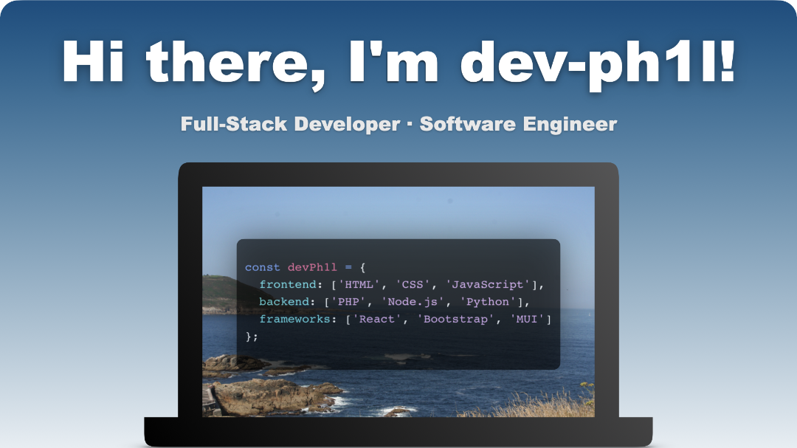

<h2 align="center">:open_file_folder: Projects</h2>
- Working on <a href="https://github.com/ocean-cms/ocean-cms">Ocean CMS</a>, an easy-to-use, fast, static cms for the modern web

  
<h2 align="center">:computer: Languages & Frameworks</h2>

- Frontend:  HTML, CSS, JavaScript, React, Bootstrap
- Backend: NodeJS, PHP 
- General purpose: Python
- Currently learning: Java, C++ 

  

&copy; 2022 dev-ph1l
